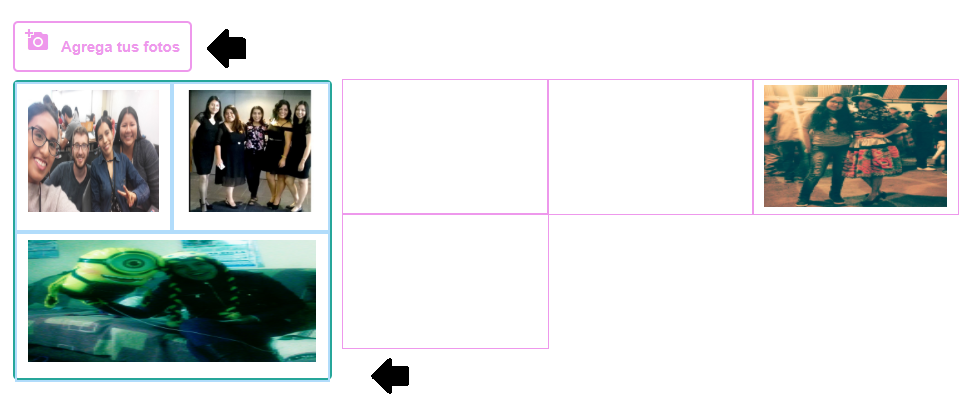

## INSTA COLLAGE

Insta collage es una aplicación movil,
en la cual le permite al usuario subir sus fotos e editar fotos y crear collages increíbles de fotos y tarjetas.

> Yanina Mercado

#### Herramientas utilizadas :

- HTML
- CSS
- Framework Bootstrap
- javascript    
- firebase

### Objetivo

Mostrar las fotos en el dispositivo, que seleccione el usuario y en la parte posterior que se agregan las fotos, arrastrar y soltar las fotos con el fin de crear un collage.
Como la siguiente imagen que se muestra.

 
 

